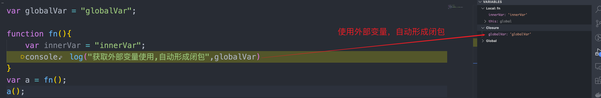

# 闭包

1. 闭包是指在一个封闭的空间，该空间存储了其他空间`能`使用的变量，主要是通过`Javascript`作用域链实现
2. 自动形成的闭包: 在函数运行时使用了外部变量，会自动形成闭包也会随着函数的执行自动销毁
3. 人为形成的闭包: 把一个局部的变量让外部环境使用而且此变量会持续在内存中存活，不随着上下文环境一同被销毁

## 1. 自动形成的闭包

- 在全局环境中声明一个全局变量供其他环境访问
- 在全局环境声明一个函数`fn`, 在函数内部访问全局变量
- 通过`debug`模式执行`fn`函数，观察右侧产生了一个闭包选项，其中便是使用的外部变量

```js 
var globalVar = "globalVar";

function fn(){
    var innerVar = "innerVar";
    console.log("获取外部变量使用,自动形成闭包",globalVar);
}
fn();
```



### 总结

1. 由于这种闭包会自动形成自动销毁, 所以对开发时并不会产生什么副作用

## 2. 人为形成闭包

- 在一个函数内部(局部环境)声明一个变量供内部使用
- 该函数返回一个函数并且在返回函数中使用父级函数中声明的变量
- 由于把内部变量带到了外部环境使用，因此垃圾回收机制不会回收该变量，该变量会一直存活在内存中

```js
function fn(){
    var innerVar = "innerVar";
    return function fn01(){
        var innerVar01 = "innerVar01";
        console.log("把内部变量用于外部使用,人为形成闭包可能会造成内存泄漏",innerVar);
        return function fn02(){
            console.log("把内部变量用于外部使用,人为形成闭包可能会造成内存泄漏",innerVar01);
        }
    }
}
var a = fn();
a();
```

### 总结

1. 由于这种闭包是人为主动形成的，并且影响了垃圾回收机制会增大内存的开销
2. 根据这种操作模式，我们可以用人为闭包解决全局变量污染、私有化变量等操作
3. 但是如果在开发中滥用闭包，那么就会造成内存泄漏即内存溢出，此时应当根据垃圾回收机制手动赋值为`null`

## 3. 常见闭包陷阱

1. 循环中使用`var`声明变量并在`setTimeout`中使用

   ```js
   for(var i = 0; i < 10; i ++){
       setTimeout(function(){
           console.log("i",i)
       },0)
   }
   ```

   - 由于`var`声明的变量不存在块级作用域的能力，此处可表达为全局变量`i`
   - 那么由于`Javascript`运行机制`事件循环`的基础上`for`循环会执行完成后再执行`setTimeout`产生的宏任务
   - 因此再执行`console.log("i",i)`时它所访问的是全局变量`i`
   - 即以上全部输出`i 10`

2. 利用闭包修改以上陷阱

   - 根据以上，我们通过函数形成一个内部变量并且在`setTimeout`中使用该内部变量便形成了人为闭包
   - 根据`Javascript`作用域链原理, `setTimeout`中访问的就是函数的内部变量

   ```js
   for(var i = 0; i < 10; i ++){
       (function(){
           var iCopy = i;
           setTimeout(function(){
               console.log("i",iCopy)
           },0)
       })()
   }
   ```

3. 利用`let`修改以上陷阱(块级作用域)

   ```js
   for(let i = 0; i < 10; i ++){
           setTimeout(function(){
             console.log("i",i)
         },0)
   }
   ```

   

